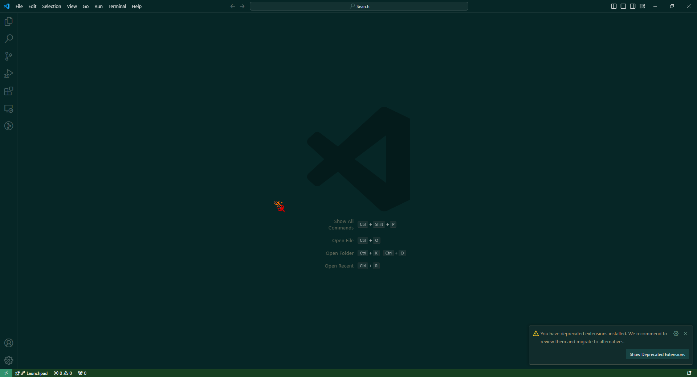
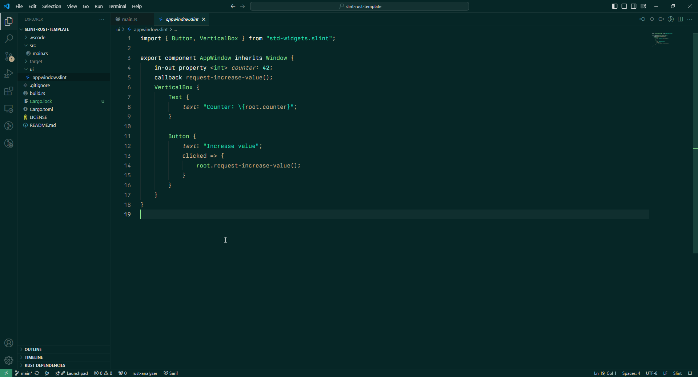
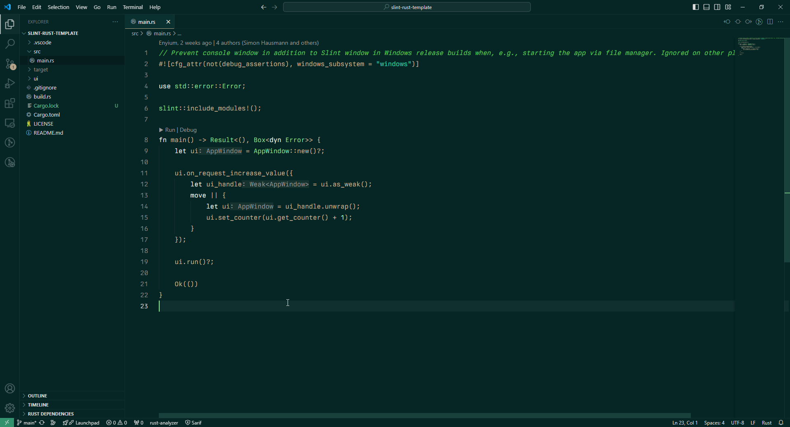

# Blowington Theme

The Blowington theme is a recreation of the editor theme of a, perhaps quite controversial person, Jonathan Blow.
I find it to be quite visually pleasant and nice to the eyes.

While I have tried my best to recreate it, it is not entirely 1:1 in terms of accuracy.

Please feel free to create issues about any specific parts of the theme you don't like and I will take a look at it.

# Previews

---

---

---

The font in these examples is [`Berkeley Mono`](https://berkeleygraphics.com/typefaces/berkeley-mono/), it is a paid font but I like it. Consider buying it if you like it.

I also recommend using `JetBrains Mono` or `Iosevka`.
You can use a font of your own choice, of course.

The theme is licensed as MIT.